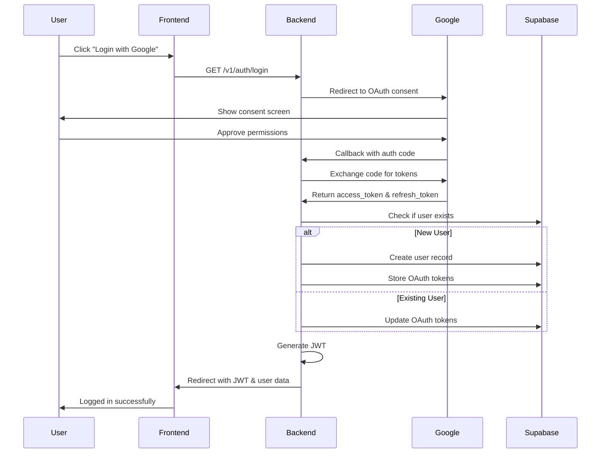

# Authentication Workflow - Ohara API

This document explains the complete authentication and authorization workflow in the Ohara backend API.

## Table of Contents
- [Overview](#overview)
- [Authentication Methods](#authentication-methods)
- [Google OAuth 2.0 Flow](#google-oauth-20-flow)
- [JWT Token Management](#jwt-token-management)
- [API Key Authentication](#api-key-authentication)
- [Guards and Security](#guards-and-security)
- [Database Schema](#database-schema)
- [Examples](#examples)

---

## Overview

Ohara implements a **multi-layered authentication system** with three distinct methods:

1. **Google OAuth 2.0** - Primary user authentication via Google accounts
2. **JWT Tokens** - Session management after OAuth authentication
3. **API Keys** - Server-to-server and admin authentication

### Key Components

```
┌─────────────────┐
│   Frontend      │
└────────┬────────┘
         │
         ▼
┌─────────────────┐      ┌──────────────────┐
│  Auth Controller│◄────►│  Auth Service    │
└────────┬────────┘      └────────┬─────────┘
         │                        │
         ▼                        ▼
┌─────────────────┐      ┌──────────────────┐
│   Strategies    │      │  Users Service   │
│ - Google OAuth  │      │                  │
│ - JWT           │      │  Supabase Client │
└─────────────────┘      └──────────────────┘
         │
         ▼
┌─────────────────┐
│     Guards      │
│ - JwtAuthGuard  │
│ - ApiKeyGuard   │
│ - Hybrid        │
└─────────────────┘
```

---

## Authentication Methods

### 1. Google OAuth 2.0 (Primary)
- **Purpose**: Initial user authentication
- **Flow**: Redirect-based OAuth 2.0
- **Scope**: `email`, `profile`
- **Token Storage**: Access & refresh tokens stored in `user_auth_tokens` table

### 2. JWT Tokens
- **Purpose**: API session management
- **Algorithm**: HS256 (HMAC with SHA-256)
- **Expiration**: 2 hours (configurable via `JWT_EXPIRES_IN`)
- **Payload**: `{ id: string, email: string }`
- **Header**: `Authorization: Bearer <jwt_token>`

### 3. API Keys
- **Purpose**: Server-to-server communication, admin access
- **Header**: `x-api-key: <admin_api_key>`
- **Privileges**: Full admin access (bypasses ownership checks)

---

## Google OAuth 2.0 Flow

### Step-by-Step Process


